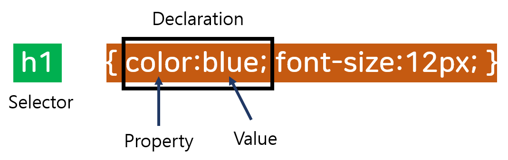

# CSS Syntax

CSS는 하나의 selector와 하나의 declaration block로 이루어져 있다.



- Selector는 style을 주고자 하는 HTML element를 뜻한다. 위에서는 h1태그에 style을 적용한다는 뜻
- Declaration block은 하나 이상의 declaration이 존재하고 이들은 `;`으로 구분해서 사용한다.
- 각각의 declaration은 하나의 CSS property name과 value를 가지고 이 둘은 `:`으로 구분한다.
- CSS delclaration은 항상 끝을 의미하는 ;을 반드시 써줘야 하고 declaration blocks는 { } 로 감싸져있어야 한다.


# CSS Comments

CSS에서 주석은 코드 설명에 주로 사용되어지고 이는 나중에 코드 수정시 도움이 된다.

주석은 /* input comments */로 사용되어진다.

```css
p {
	color: red;
	/* text color is red */
}
```


# CSS Selectors

CSS selectors는 style을 주고자하는 HTML elements을 찾을 때 사용되어진다.

CSS selectors는 다섯 개의 카테고리로 나눌 수 있다.

- Simple selectors (id, class, name)

- Combinator


