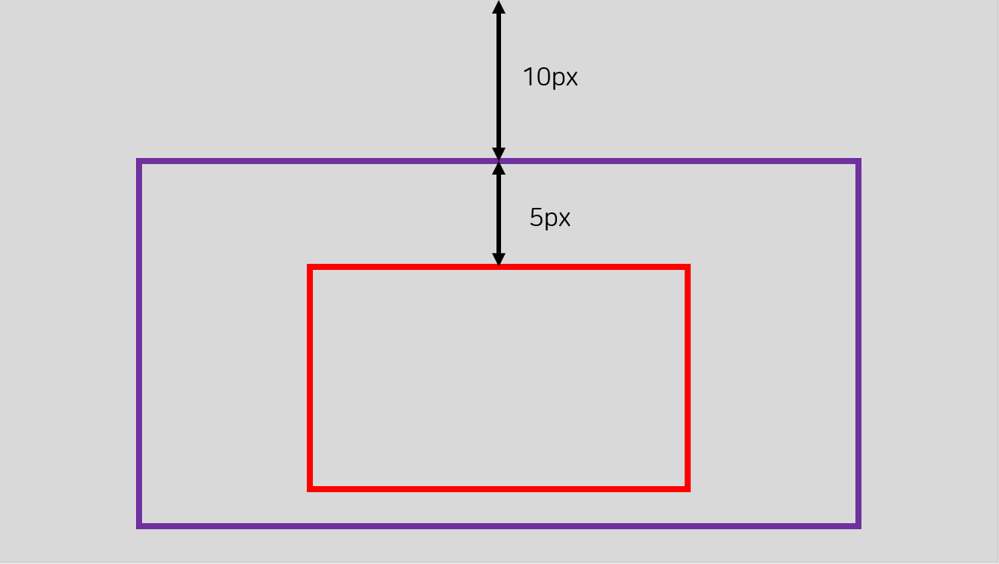
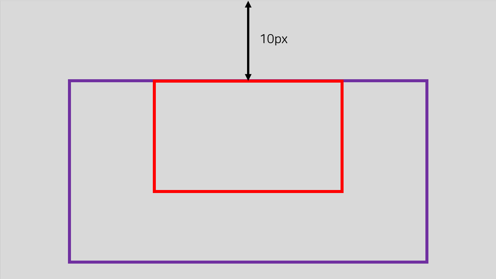
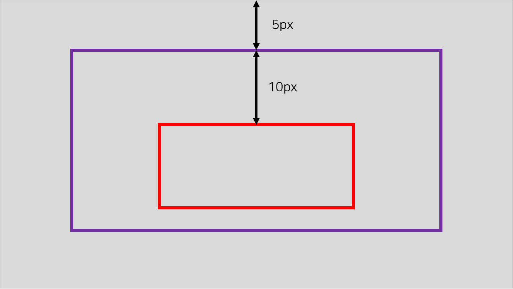
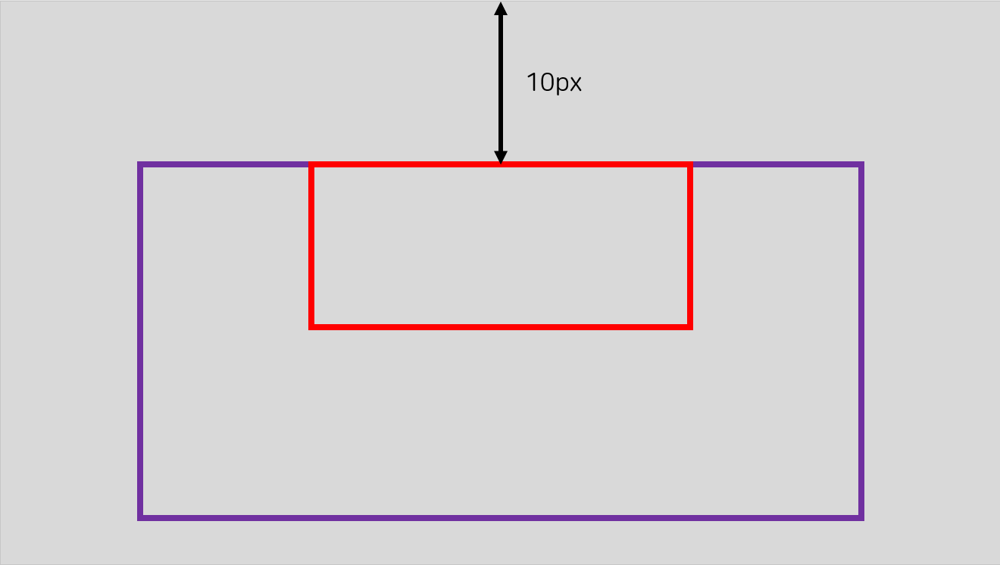
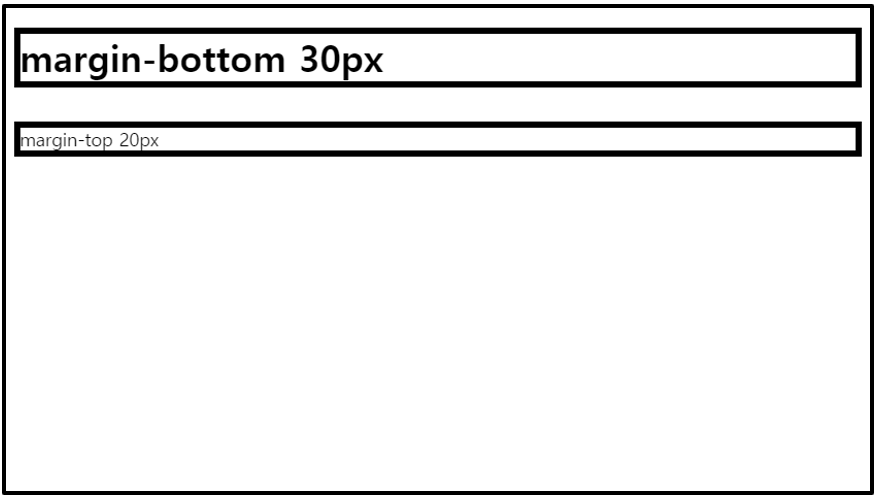
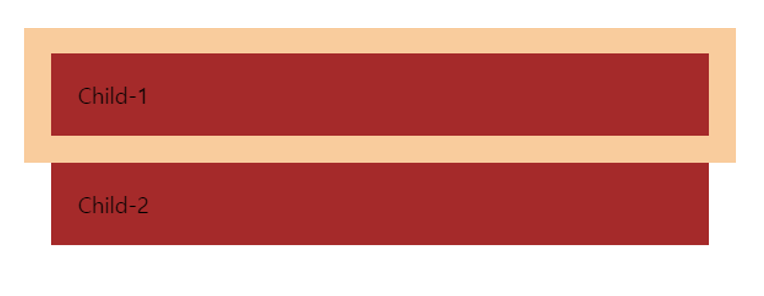

# CSS Margins

- CSS `margin` 속성들은 정의된 외부 경계선, element들 주위 공간을 만들때 사용한다.
- margin 속성으로 한 element의 각 side(top, right, bottom, and left)를 설정할 수 있다.


## Margin - Individual Sides

- CSS margin은 한 element의 각 side 속성들 가진다.

### Property

- margin-top

- margin-right

- margin-bottom

- margin-left

### Value

- auto : 브라우저가 margin을 계산해서 적용
- length : px, pt, cm 등으로 margin을 설정
- % : 포함된 element의 폭을 %로 설정
- inherit : 부모 element로부터 margin 값을 상속받아 설정

```css
p {
  margin-top: 100px;
  margin-right: 110px;
  margin-bottom: 120px;
  margin-left: 10%;
}
```


## Margin - Shorthand Property

- margin의 각 side 속성들을 다음과 같은 순서로 한 줄로 사용할 수 있다.
- margin-top, margin-right, margin-bottom, margin-left 

```css
p {
  margin-top: 100px;
  margin-right: 110px;
  margin-bottom: 120px;
  margin-left: 10%;
}
```

```css
p { 
  margin: 100px 110px 120px 10%;
}
```


- 3개일 경우, top, right&left, bottom

```css
p {
	margin: 100px 110px 10%;
}
```

- 2개일 경우, top&bottom, right&left

```css
p {
	margin: 100px 110px;
}
```

- 1개일 경우, 모든 side에 적용

```css
p {
	margin: 100px;
}
```


## The auto Value

- container 안 element를 가로 중앙에 위치시키고 싶으면 margin 속성에 auto value를 사용하면 된다.
- auto value를 적용한 element는 지정된 width를 차지하고, 남아있는 공간은 왼쪽, 오른쪽 margin을 동등하게 분할된다.


## The inherit Value

- 아래는 div 태그 안 p 태그의 margin-left가 inherit이므로 p 태그의 바로 상위 태그인 div 태그의 margin-left가 적용된다.

```html
<!DOCTYPE html>
<html>
<head>
<style>
div {
  border: 1px solid red;
  margin-left: 100px;
}

p.ex1 {
  margin-left: inherit;
}
</style>
</head>
<body>

<h2>Use of the inherit value</h2>
<p>Let the left margin be inherited from the parent element:</p>

<div>
	<p class="ex1">
		This paragraph has an inherited left margin (from the div element).
	</p>
</div>

</body>
</html>
```


## Margin Collapse

- CSS에서는 마진 병합, 붕괴라고 불리는 현상이 있다.
- 바깥 여백의 충돌 현상은 각 margin이 더해지지 않고 두 바깥 여백 중에 큰 margin 하나로만 축소되는 현상으로 collapsing margin이라고 한다.
- 위와 같이 설명하면 큰 문제점이라고 생각할 수도 있지만 마진 병합 현상은 의도된 부분이다. CSS는 한 문서를 디자인적으로 안정적이고 보기 편하게 위해 사용하는데 이를 위해서 일부러 병합 현상이 일어나게 설계를 해두었다고 한다.
- 따라서 문제점이라기 보다는 보기 좋게 해주는 이로운 점이라고 봐도 될 것 같다.

### 마진 병합 현상이 일어나기 위한 조건!

#### 1. 인접해있는 Block 요소끼리만 발생

#### 2. 상하단만 해당


### 1)







### 2)







- 위 그림과 같이 보통 한 element의 아래쪽 margin이 다른 element의 위쪽 margin과 만날 경우 둘 중 가장 큰 값으로 margin이 적용되는 것을 마진 병합이라고 한다.

```html
<h1>margin-bottom 30px</h1>
<p>margin-top 20px</p>
```

```css
h1 {
  margin-bottom:30px; 
  border:5px solid black;
}

p {
  margin-top:20px;
  border:5px solid black;
}
```



- 설정대로라면 30 + 20 = 50px만큼의 여백이 생겨야 정상인데 그렇지 않다.
- 웹 브라우저는 그 중 가장 큰 값으로 여백을 적용한다, 따라서 30px만큼만 여백을 만든다.


---

- 또 다른 예로는 부모 요소 안 인접해있는 자식 요소들 간 margin이 겹치는 것을 볼 수 있다.

```html
<div class = "parent">
  <div class = "child">
    Child-1
  </div>
  <div class = "child">
    Child-2
  </div>
</div>
```

```css
.child {
  background-color: brown;
  margin:20px;
  padding:20px;
}
```

- 구글 크롬 개발자 도구를 통해서 child-1의 아래쪽과 child-2의 위쪽 margin이 겹쳐져있는 것을 확인할 수 있다.



- 이 경우 parent와 child 사이에 무언가 있으면 마진 병합이 일어나지 않는다.(발생 조건 1번 없애기)
- 부모에게 padding을 구저나 border 속성을 주어서 해결할 수 있다.
- 마진 병합 현상이 일어나는 조건 2번을 없애기 위해 child의 display 속성을 inline-block으로 주면 부모와의 마진 병합 현상은 일어나지 않지만 child 간 마진 병합이 사라져서 기존 간격으로 벌어진다.
- 위 두 방법을 이용하면 마진 병합 현상은 해결되지만 처음 자신이 의도한 디자인이랑 멀어질 수 있다.
- 그러면 어떤 방법이 가장 안정적일까?
  - parent의 overflow 속성에 hidden을 주면 해결된다.
  - overflow는 element의 내용이 특정 공간에 들어가기엔 너무 큰 경우 스크롤바를 만들거나 숨기거나 나타내거나 할 때 쓰이는 속성이다.

